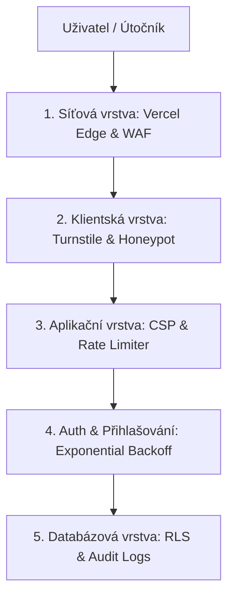

# Bezpečnostní příručka & Architektonický standard (Cybersecurity)
Tento dokument slouží jako komplexní přehled implementovaného zabezpečení systému **AZ-Composites** a zároveň jako obecný architektonický standard pro vývoj bezpečných webových aplikací v moderním stacku (Next.js + Vercel + Supabase).

---

## 1. Vícevrstvá obrana (Defense in Depth)

Bezpečnost webových aplikací nikdy nesmí spoléhat na jediný ochranný prvek. Účinné zabezpečení vyžaduje rozdělení obrany do několika nezávislých vrstev:



---

## 2. Přehled implementovaného zabezpečení AZ-Composites

### 2.1 Edge & Síťová vrstva (První linie obrany)
*   **Vercel WAF & Bot Protection:** Automatická filtrace škodlivého provozu, známých botů a scraperů na úrovni globální doručovací sítě (Edge).
*   **Danger Zone — Attack Mode:** Možnost rychlého zapnutí JS výzev pro podezřelý provoz přímo ve Vercel administraci v případě probíhajícího DDoS útoku.

### 2.2 Klientská verifikace
*   **Honeypot:** Skryté pole `website_verification` ve formulářích. Pokud jej bot automaticky vyplní, backend uplatní umělou penalizaci (spánek na 2 sekundy) a požadavek zahodí. Tím se šetří výpočetní čas databáze.
*   **Cloudflare Turnstile:** Uživatelsky přívětivá alternativa k reCAPTCHA bez sledování uživatelů (GDPR-compliant). Ověřuje legitimitu prohlížeče před odesláním citlivých dat.

### 2.3 Kontrola přístupu & Zabezpečení přihlášení
*   **Exponential Backoff (Ochrana proti slovníkovým útokům):**
    *   Místo trvalého zablokování účtu (které by mohl útočník vyvolat záměrně pro odříznutí zaměstnanců) systém uplatňuje progresivní časovou penalizaci.
    *   Počty neúspěšných pokusů se logují do tabulky `failed_logins` a párují se jak na e-mail, tak na IP adresu (ochrana před distribuovanými útoky).
    *   **Progresivní prodlevy:** 3. pokus (30 s), 4. pokus (5 min), 5+ pokus (30 min).
    *   Po úspěšném přihlášení se čítač automaticky resetuje.

### 2.4 Aplikační vrstva (Next.js & Security Headers)
*   **Content Security Policy (CSP):**
    *   Centrálně definovaná v `next.config.ts`.
    *   Povoluje spouštění klientských skriptů pouze z naší domény a z Cloudflare (Turnstile).
    *   Omezuje datová spojení (`connect-src`) výhradně na Supabase a Cloudflare API.
    *   Zabraňuje injektáži cizího kódu (XSS).
*   **X-Frame-Options (DENY):** Zabraňuje vložení systému do cizích iframe (ochrana proti Clickjackingu).
*   **X-Content-Type-Options (nosniff):** Brání prohlížeči interpretovat soubory jako jiný MIME typ, než je deklarováno.
*   **Limiter požadavků (Rate Limiter):**
    *   Implementován v Edge Middleware (`src/proxy.ts`).
    *   Globální limit (120 req/min/IP) a citlivý limit (15 req/min/IP pro POST a login trasy).
    *   Při překročení vrátí chybovou stránku (HTTP 429).

### 2.5 Databázová vrstva (Supabase & RLS)
*   **100% aktivní RLS (Row Level Security):**
    *   Všech 38 tabulek v databázi má povolenou ochranu RLS (`ALTER TABLE ENABLE ROW LEVEL SECURITY`).
    *   Uživatelé bez tokenu nebo s nedostatečnou rolí (Role-Based Access Control - RBAC) nemohou číst ani zapisovat žádná data, a to ani přes přímé REST API Supabase.
*   **Zabezpečené Server Actions (ensureAdmin):**
    *   Kritické administrátorské operace, které obcházejí RLS na serveru, jsou explicitně chráněny funkcí `ensureAdmin()`. Ta ověřuje roli volajícího uživatele v databázi z podepsaných cookies.
*   **Append-Only Audit Logs:**
    *   Auditní tabulky (`*_audit_log`) nemají definované žádné `UPDATE` ani `DELETE` RLS politiky.
    *   To znamená, že nikdo přes klientské API nemůže logy přepsat ani smazat (operace jsou databází striktně odmítnuty). Zápis provádí výhradně backend pod servisním klíčem.

---

## 3. Best Practices pro vývoj bezpečných webů

Při dalším rozšiřování systému nebo tvorbě nových projektů vždy dodržujte následující pravidla:

### 1. Nikdy nevěřte vstupu z klienta (Zero Trust)
*   Jakákoliv data odeslaná z prohlížeče (formuláře, parametry v URL, JSON payload) musí být před zpracováním **validována na backendu** (např. pomocí knihovny Zod).
*   Klientská validace slouží pouze pro UX, backendová validace je ta, která chrání systém.

### 2. RLS musí být zapnuto na každé tabulce
*   Při vytvoření nové tabulky v PostgreSQL okamžitě spusťte:
    ```sql
    ALTER TABLE public.moje_nova_tabulka ENABLE ROW LEVEL SECURITY;
    ```
*   Bez definování politik (`POLICY`) nebude moci nikdo zvenčí tabulku číst ani do ní zapisovat, což je bezpečný výchozí stav (Fail Closed).

### 3. Ochrana citlivých endpointů
*   Trasy pro přihlášení, registraci, reset hesla nebo platební brány musí být vždy chráněny:
    1.  Ochranou proti robotům (CAPTCHA / Turnstile).
    2.  Nízkým rate limitem (např. max 5 požadavků za minutu na IP).
    3.  Pomalým hashováním hesel (v Supabase zajištěno automaticky přes bcrypt).

### 4. Správa hesel a přístupů
*   Hesla musí mít minimální délku 8 znaků a kombinovat velká/malá písmena, číslice a speciální znaky.
*   Při ukládání chyb do externích logovacích služeb (např. Sentry) vždy aktivujte filtraci citlivých dat (Data Scrubbing), aby nedocházelo k úniku hesel nebo osobních údajů zákazníků.

### 5. Bezpečné nakládání s API klíči
*   Klíče začínající na `NEXT_PUBLIC_` jsou viditelné v prohlížeči uživatele a nesmí mít administrátorská oprávnění.
*   Administrátorské klíče (např. Supabase Service Role Key) uložte do `.env.local` a **nikdy** je neposílejte do klientského prohlížeče (nepoužívejte pro ně prefix `NEXT_PUBLIC_`). Tyto klíče nesmí být nikdy commitnuty v gitu.

---

## 4. Havarijní scénáře & První pomoc

### Co dělat, když...

#### ...dochází k masivnímu DDoS útoku a web se zpomaluje:
1.  Přihlaste se do administrace **Vercel**.
2.  Přejděte do projektu -> záložka **Firewall** -> sekce **Danger Zone**.
3.  Klikněte na tlačítko **`Enable Attack Mode`**.
4.  Tím vynutíte JS výzvu pro veškerý provoz, čímž bleskově odrazíte robotické útoky. Po skončení útoku režim opět vypněte.

#### ...je potřeba obnovit databázi ze zálohy:
*   Supabase provádí automatické zálohování každých 24 hodin (Point-in-Time Recovery - PITR je-li aktivní). Obnovu lze provést přímo v Supabase Dashboardu pod záložkou **Database** -> **Backups**.

#### ...zaměstnanec zapomene heslo:
*   Administrátor může heslo bezpečně resetovat v administraci týmu (`Správa -> Uživatelé a Tým`), kde je integrovaná funkce pro vygenerování nového hesla splňujícího bezpečnostní kritéria.
