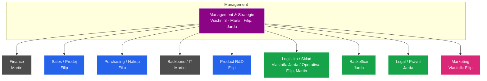

# Organizační Struktura, Oddělení a Metodika Plánování (AZ-Composites)

> **Verze**: 1.0 — Strategická a procesní architektura  
> **Autor**: CEO / Konzultant rozvoje  
> **Účel**: Tento dokument definuje organizační strukturu společnosti **AZ-Composites**, rozdělení odpovědností mezi zakladatele a metodiku, jak tyto departmenty zrcadlit v našem ERP/CRM systému. Cílem je dosáhnout provozní dokonalosti (úroveň Amazon / Rohlík) v týmu o 3 lidech s výhledem na škálování.

---

## 1. CEO Vize: Jak řídit firmu ve 3 lidech jako globální lídr

Pokud chceme vybudovat distribuční firmu na úrovni Amazonu nebo Rohlíku, musíme opustit garážový styl řízení typu „všichni dělají všechno“. I když jsme v týmu pouze tři zakladatelé, musíme firmu rozdělit na jasně definovaná **oddělení (Departments)**, kde každé oddělení má **jediného odpovědného vlastníka (Single-Threaded Owner)**. 

### Princip Amazonu: Single-Threaded Ownership (STO)
V Amazonu platí pravidlo: *„Pokud za výsledek odpovídá více než jeden člověk, neodpovídá za něj nikdo.“* 
* Přestože se v operativě budeme překrývat (např. Filip i Martin budou fyzicky balit zásilky), **vlastníkem procesu** a tím, kdo odpovídá za to, že proces funguje, je vždy pouze jeden z nás.
* Vlastník oddělení navrhuje rozpočet, určuje priority vývoje v ERP, nastavuje SLA (servisní úroveň) a nese odpovědnost za neúspěch.

### Princip Rohlíku: Metrika a SLA na prvním místě
Každé oddělení musí být měřitelné v našem ERP:
* U nákupu sledujeme průměrnou marži a nákupní ceny.
* U logistiky sledujeme chybovost balení a rychlost expedice.
* U IT (Backbone) sledujeme uptime systému a rychlost nasazování funkcí.

---

## 2. Organizační diagram a rozdělení rolí (RACI)

Společnost se dělí na **10 klíčových oddělení**. Zde je přehled jejich vlastníků, odpovědností a klíčových výkonnostních ukazatelů (KPIs).



### Detailní popis oddělení

#### 1. Management & Strategie
* **Vlastník**: `@` (Všichni 3 spoluvlastníci společně)
* **Klíčové činnosti**: Krátkodobé, střednědobé a dlouhodobé plánování, vize firmy, schvalování investic nad 50 000 Kč, strategická partnerství.
* **KPI**: Růst hodnoty firmy (Valuation), celkový obrat a ziskovost (EBITDA).

#### 2. Finance
* **Vlastník**: **Martin**
* **Klíčové činnosti**: Vedení účetnictví (komunikace s externí účetní), finanční plánování (Cash Flow, Runway, Break-Even), řízení investic, finanční správa bankovních účtů a platebních bran.
* **KPI**: Udržení kladného cash flow, včasné splácení závazků, přesnost finančních forecastů.

#### 3. Sales (Obchod)
* **Vlastník**: **Filip**
* **Klíčové činnosti**: Vyhledávání a evidence B2B zákazníků (Leads), studené kontakty (Cold calling), obchodní jednání, příprava cenových nabídek, follow-ups, péče o stávající klíčové zákazníky, obchodní strategie.
* **KPI**: Počet nových akvírovaných zákazníků, konverzní poměr nabídek, celkový objem prodejů (Revenue).

#### 4. Purchasing (Nákup)
* **Vlastník**: **Filip**
* **Klíčové činnosti**: Hledání a vyjednávání s evropskými a globálními distributory/výrobci, vyjednávání cen a platebních podmínek (SLA, splatnost), zajišťování vzorků pro testování, stanovování prodejních marží.
* **KPI**: Průměrná hrubá marže (Gross Margin %), nákupní úspory (Purchase Price Variance), spolehlivost dodavatelů (OTIF - On-Time In-Full).

#### 5. Backbone (IT, Systém a Automatizace)
* **Vlastník**: **Martin**
* **Klíčové činnosti**: Správa a vývoj vlastního ERP/CRM systému, automatizace rutinních procesů, správa hardware a software infrastruktury, správa a vývoj webové prezentace a budoucího headless e-shopu.
* **KPI**: Uptime systému (99.9%), rychlost vývoje nových modulů (Velocity), procento automatizovaných procesů (např. automatické vystavení faktury z e-shopu).

#### 6. Product R&D (Výzkum, Vývoj a Testování)
* **Vlastník**: **Filip**
* **Klíčové činnosti**: Fyzické testování vzorků (tkaniny, pryskyřice, prepregy), vývoj nových kompozitních produktů, vyhledávání inovativních materiálů na trhu, laboratorní měření fyzikálních vlastností, lokalizace a certifikace produktů pro zahraniční trhy.
* **KPI**: Počet úspěšně zalistovaných nových produktů, úspěšnost testů vzorků, rychlost uvedení produktu na trh (Time-to-Market).

#### 7. Logistika (WMS, Sklad a Doprava)
* **Rozhodnutí CEO o změně**: V původních poznámkách byla logistika sdílená (Martin, Filip). To je provozní riziko. **Vlastníkem logistiky a skladu se stává Jarda**, který má na starosti Backoffice a Legal. Skladování a expedice úzce souvisí s tiskem štítků, reklamacemi a expedovanou dokumentací.
* **Vlastník**: **Jarda** (Operativní výpomoc: Filip, Martin při balení velkých zásilek)
* **Klíčové činnosti**: Příjem zboží, správa skladových lokací (WMS), fyzické balení a expedice zásilek, zajišťování dopravy (smlouvy s DPD, PPL, Geis), správa fyzické infrastruktury skladu, správa ADR limitů a nebezpečných látek.
* **KPI**: Rychlost expedice (objednávka -> předání dopravci do 24h), chybovost balení (v % zásilek), optimální stav zásob (obrátka skladu).

#### 8. Backoffice
* **Vlastník**: **Jarda**
* **Klíčové činnosti**: Podpora nákupu a prodeje (příprava podkladů), tisk a aplikace štítků (etiket) na zboží a chemické obaly, správa prodejní dokumentace (faktury, dodací listy), správa a archivace technických (TDS) a bezpečnostních (SDS) listů, vyřizování reklamací (claims).
* **KPI**: Rychlost vyřízení reklamace, bezchybnost vygenerované dokumentace, rychlost odeslání podkladů pro účetnictví.

#### 9. Legal (Právní a Compliance)
* **Vlastník**: **Jarda**
* **Klíčové činnosti**: Tvorba a aktualizace Všeobecných obchodních podmínek (VOP), soulad s nařízením REACH/CLP pro distribuci chemie, právní soulad SDS a TDS dokumentů, ochrana osobních údajů (GDPR), příprava smluv.
* **KPI**: 100% soulad s legislativou (nula pokut při kontrolách), rychlost revize smluv.

#### 10. Marketing
* **Vlastník**: **Filip** (Marketing přímo podporuje Sales)
* **Klíčové činnosti**: Budování vizuální identity AZ-Composites, tvorba brožur, vizitek, katalogů, správa sociálních sítí (LinkedIn, Instagram), správa reklamních kampaní (Google Ads, Meta), produktová fotografie, tvorba video obsahu (YouTube technická videa), sponzoring.
* **KPI**: Počet marketingových leadů (MQL), návratnost investic do reklamy (ROAS), zásah značky na sociálních sítích.

---

## 3. Technická Implementace v ERP/CRM

Pro efektivní delegování a zobrazení v systému musíme databázi a UI přizpůsobit této struktuře.

### A. Databázový model (Změny)

Zavedeme číselník oddělení a propojíme s ním milníky, úkoly a uživatelská oprávnění.

```sql
-- 1. Číselník oddělení (Departments)
CREATE TABLE public.oddeleni (
    id                  TEXT PRIMARY KEY, -- 'sales', 'finance', 'logistics', 'backbone', etc.
    nazev               TEXT NOT NULL,
    vlastnik_id         UUID REFERENCES public.profily_uzivatelu(id) ON DELETE SET NULL,
    barva               TEXT NOT NULL DEFAULT '#4D4D4D',
    vytvoreno_at        TIMESTAMP WITH TIME ZONE DEFAULT timezone('utc', now()) NOT NULL
);

-- 2. Přidání vazby do milníků (Pro provázání velkých fází s odděleními)
ALTER TABLE public.milniky 
ADD COLUMN oddeleni_id TEXT REFERENCES public.oddeleni(id) ON DELETE SET NULL;

-- 3. Tabulka specifických podrobných úkolů (Tasks backlog)
-- Každý milník má N detailních úkolů rozdělených podle oddělení.
CREATE TABLE public.ukoly_planovani (
    id                  UUID PRIMARY KEY DEFAULT gen_random_uuid(),
    milnik_id           UUID NOT NULL REFERENCES public.milniky(id) ON DELETE CASCADE,
    oddeleni_id         TEXT NOT NULL REFERENCES public.oddeleni(id),
    nazev               TEXT NOT NULL,
    popis               TEXT,
    stav                TEXT NOT NULL DEFAULT 'todo' CHECK (stav IN ('todo', 'in_progress', 'done', 'blocked')),
    priorita            TEXT NOT NULL DEFAULT 'medium' CHECK (priorita IN ('low', 'medium', 'high', 'critical')),
    vlastnik_id         UUID REFERENCES public.profily_uzivatelu(id) ON DELETE SET NULL,
    datum_splatnosti    DATE,
    vytvoreno_at        TIMESTAMP WITH TIME ZONE DEFAULT timezone('utc', now()) NOT NULL,
    aktualizovano_at    TIMESTAMP WITH TIME ZONE DEFAULT timezone('utc', now()) NOT NULL,
    vytvoril_id         UUID REFERENCES public.profily_uzivatelu(id) ON DELETE SET NULL,
    upravil_id          UUID REFERENCES public.profily_uzivatelu(id) ON DELETE SET NULL
);

CREATE INDEX ukoly_milnik_idx ON public.ukoly_planovani (milnik_id);
CREATE INDEX ukoly_oddeleni_idx ON public.ukoly_planovani (oddeleni_id);
CREATE INDEX ukoly_vlastnik_idx ON public.ukoly_planovani (vlastnik_id);
```

### B. Oprávnění (RBAC) a Zabezpečení

Oprávnění v systému budou přímo provázána s odděleními. Uživatel s určitou rolí má přístup k příslušným modulům:

| Role v ERP | Přístupná oddělení (Zápis) | Příklad použití |
|:---|:---|:---|
| `admin` | Všechna oddělení | Úplná kontrola nad celým systémem |
| `sales_manager` | Sales, Marketing, Product R&D | Filip (řídí obchod a nákup) |
| `finance_manager`| Finance, Invoicing | Martin (platby, banka, ceníky) |
| `ops_manager` | Logistics, Backoffice, Legal | Jarda (sklady, štítky, SDS/TDS) |
| `developer` | Backbone, Planning | Martin (vývoj ERP a nastavení) |

---

## 4. Metodika plánování: Master Plan vs. Departmental Backlog

Jedním z nejčastějších problémů plánování v rostoucích firmách je, že se strategický plán (Master Plan) zahltí stovkami malých úkolů (např. *„Koupit izolepu do skladu“* nebo *„Opravit překlep na webu“*). To znehodnocuje Ganttův diagram a management ztrácí přehled.

Implementujeme **dvouúrovňové plánování (WBS - Work Breakdown Structure)**:

### 1. Úroveň: Master Milestones (Strategie)
* Evidováno v tabulce `milniky`.
* Definuje **kdy a co** se stane z pohledu celé firmy.
* Příklady: `Milník 1 — Budování a růst` (Termín: 1. 8. – 30. 9.).
* V Ganttově diagramu a na hlavní časové ose jsou vidět **pouze tyto strategické milníky**.

### 2. Úroveň: Departmental Tasks (Operativa)
* Evidováno v tabulce `ukoly_planovani`.
* Každé oddělení má svůj **vlastní backlog úkolů** přiřazených k danému milníku.
* Příklad: K milníku `Milník 1 — Budování a růst` se vážou tyto detailní úkoly:
  * **Finance (Martin)**: *Zprovoznit účetní export do Pohody*, *Vytvořit šablonu cash flow*.
  * **Sales (Filip)**: *Oslovit 30 laminátoven v ČR*, *Připravit ceník vzorků*.
  * **Logistika (Jarda)**: *Objednat 500 ks krabic na pryskyřice*, *Sjednat ADR smlouvu s DPD*.
  * **Backbone (Martin)**: *Vytvořit databázový modul pro CRM*, *Napojit ARES pro IČO*.

### UI a UX v ERP: Jak to uvidíme?

1. **Firemní Dashboard (Gantt / Timeline)**:
   * Manažerský pohled. Zobrazuje pouze velké milníky.
   * Progres milníku se automaticky vypočítává jako **procento splněných operačních úkolů** ze všech oddělení, které jsou k němu přiřazeny.

2. **Oddělení (Departmental Board)**:
   * Zobrazení typu Kanban (To Do / In Progress / Done) filtrované pro jedno konkrétní oddělení (např. *Pohled Logistika*).
   * Jarda zde vidí pouze své úkoly z logistiky a backoffice, rozdělené podle aktuálního milníku. Ostatní oddělení ho neruší.

3. **Můj přehled (Personal Dashboard)**:
   * Stránka po přihlášení uživatele.
   * Zobrazuje widgety:
     * *Moje úkoly pro tento týden* (napříč všemi projekty a milníky, kde jsem `vlastnik_id`).
     * *Runway a Cash flow* (pro Martina).
     * *Dnešní schůzky a follow-up vzorků* (pro Filipa).
     * *Zásilky k expedici a chybějící SDS* (pro Jardu).

---

## 5. Implementační checklist pro vývojáře (Martin / Backbone)

Při implementaci této struktury do systému postupujte následovně:

- [ ] **Krok 1: Migrace DB**: Vytvořit novou migraci pro tabulky `oddeleni` a `ukoly_planovani` (kód v sekci 3.A).
- [ ] **Krok 2: Seeding oddělení**: Naplnit tabulku `oddeleni` deseti výše popsanými odděleními a přiřadit jim vlastníky (Martin, Filip, Jarda).
- [ ] **Krok 3: Úprava MilnikCard**: Rozšířit kartu milníku tak, aby zobrazovala úkoly seskupené podle oddělení, nebo umožnila jejich filtrování.
- [ ] **Krok 4: Tvorba Kanban Boardu**: Vytvořit novou stránku `/planovani/board`, kde bude možné filtrovat úkoly podle oddělení a vlastníka.
- [ ] **Krok 5: Automatický progres**: Naprogramovat trigger v DB nebo logiku v Server Actions, která při dokončení úkolu (`ukoly_planovani`) přepočítá `progres_procenta` nadřazeného milníku (`milniky`).

---

*Tento plán organizace je závazný pro všechny zakladatele AZ-Composites. Změny struktury podléhají schválení managementu.*
